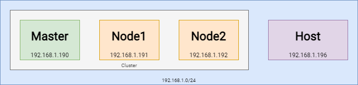

# VirtualBox cluster

This guide will demonstrate how to set up a small **cluster** of virtual machines on a local machine using VirtualBox.

At first, the VMs will be independent of each other, and the plan is to subsequently set up a Kubernetes cluster in order to experiment with it.

## VM setup

Refer to the network diagram below to visualize the network configuration.

<p align="center">
  
</p>

The following are the *recommended* settings for the virtual machines:

- **RAM**: 4GB *master* / 2GB *node*
- **CPU**: 4vCPU *master* / 2vCPU *node*
- **HDD**: 60GB *master* / 30GB *node*
- **Network**: Bridged network

We used Ubuntu Server 23.04 as Linux distribution on all of the nodes.

## OS Installation

Perform a **default installation** of the operating system. You may choose to install the full OS, but a minimized installation will suffice, as we will install the required packages when necessary.

## Minimal configuration

For each VM, repeat the steps below:

- Configure SSH to support public key authentication
- Set up the network configuration to assign static IP addresses
- Update the local SSH configuration file

### SSH

Log in to the VMs and install `nano`, `net-tools` and `openssh-server` using the following command:

```bash
sudo apt-get update && sudo apt-get install -y nano net-tools openssh-server
```

To ensure that the SSH service starts automatically at boot, run:

```bash
sudo systemctl enable ssh --now
```

Run `ifconfig` and take note of your VM's IP address. To verify that SSH is functioning properly, run the following command from your local machine:

```bash
ssh user@host
```

#### Keys configuration

Before proceeding to the next steps, ensure that you have a public and private key pair. If you need to generate a new key pair, you can follow this [GitHub Guide](https://docs.github.com/en/authentication/connecting-to-github-with-ssh/generating-a-new-ssh-key-and-adding-it-to-the-ssh-agent#generating-a-new-ssh-key). We recommend adding the following command to your shell startup configuration to start the SSH agent:  `eval $(ssh-agent) &> /dev/null`.

To add the public key to the list of authorized keys on the VMs, run the following command:

```bash
ssh-copy-id -i ~/.ssh/mykey.pub user@host
```

To verify that the key has been copied successfully, run the following command:

```bash
ssh -i ~/.ssh/mykey user@host
```

#### Remove password authentication

To disallow password authentication and only allow the use of a public key, run the following commands:

```bash
sudo sed -i 's/#PermitRootLogin prohibit-password/PermitRootLogin prohibit-password/g' /etc/ssh/sshd_config
sudo sed -i 's/#PubkeyAuthentication yes/PubkeyAuthentication yes/g' /etc/ssh/sshd_config
sudo sed -i 's/#PasswordAuthentication yes/PasswordAuthentication no/g' /etc/ssh/sshd_config
```

These commands modify the `sshd_config` file to allow only public key authentication for root login. To apply the changes, restart the `sshd` service:

```bash
sudo systemctl restart sshd
```

If you try to SSH into the VM without using the private key, you should receive an error. If not, try rebooting the VM.

## Network

To set a static IP address, create `/etc/netplan/01-netcfg.yaml` running the following command:

```bash
sudo nano /etc/netplan/01-netcfg.yaml
```

Then update the content with the following (remember to **change** the IP address):

```yaml
network:
  version: 2
  renderer: networkd
  ethernets:
    enp0s3:
      dhcp4: false
      addresses:
        - 192.168.1.190/24
      routes:
        - to: default
          via: 192.168.1.1
      nameservers:
          addresses: [8.8.8.8, 1.1.1.1, 192.168.1.1]
```

> The interface name may be different, you can find it by running the command `ifconfig`. Example: [01-netcfg.yaml](./01-netcfg.yaml)

Finally, to apply the changes, run the following commands:

```bash
sudo chmod 600 /etc/netplan/*
sudo netplan apply
```

Note: If you lose network connectivity after applying the new configuration, check for errors in the netplan configuration file and revert to the previous configuration if necessary.

### SSH config file

To simplify the process of connecting via SSH to the different VMs, it is recommended to add their information to the local SSH configuration file, which is located at `~/.ssh/config`. Based on the network diagram provided above, the configuration file would look something like this:

```ssh-config
Host master
  HostName 192.168.1.190
  AddKeysToAgent yes
  IdentityFile ~/.ssh/mykey

Host node1
  HostName 192.168.1.191
  AddKeysToAgent yes
  IdentityFile ~/.ssh/mykey

Host node2
  HostName 192.168.1.192
  AddKeysToAgent yes
  IdentityFile ~/.ssh/mykey
```

> Example: [config](./config)

### Ansible inventory

To generate the Ansible inventory file for the cluster, you can create a new file named `inventory.yaml` in the root directory of your Ansible project, and add the following content (replace the IP addresses with your own):

```yaml
all:
  children:
    master:
      hosts:
        192.168.1.190:
    nodes:
      hosts:
        192.168.1.191:
        192.168.1.192:
```

> Example: [inventory.yaml](./inventory.yaml)
